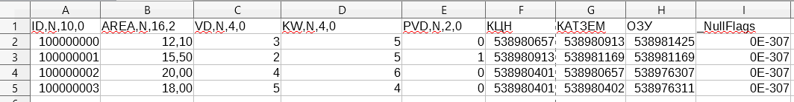

# dbf_to_txt
Convert forest inventory database in .dbf format into .txt files

This script runs in QGis (https://github.com/qgis) Python script console and works properly when active layer is a forest inventory .dbf file with specific columns, as shown on the image below:

Script runs .dbf table (in other words - .shp attributive table) row by row (or object by object), in each cycle reading columns (or features in GIS language). Rows can be ordered in a complete mess, and final file should contain objects in specific order, sorting them by two features in ascending order.

Resulting table should have a structure as shown below:

00)4,10
01)5,,20,,7
@@
00)5,12
01)2.1,,13,,13
@@
00)5,11
01)3,,12,,14
@@
00)6,10
01)4,,11,,3
@@

Script reads file path and name and write final .txt file with the same as initial .dbf
