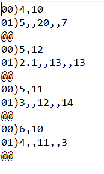

# dbf_to_txt
Преобразуем базу данных лесной таксации в формате .dbf в файл формата .txt

Данный скрипт запускается в QGIS (https://github.com/qgis) в консоли Python и работоспособен когда активным слоем является база данных в формате .dbf с определенными колонками, как показано на изображении ниже (файл sample.dbf в репозитории):

Скрипт сканирует с помощью цикла строкам по атрибутивной таблице файла (которые соответствуют определенным географическим объектам), внутри которого находится цикл, прохождения по колонкам (или свойствам объектов). Данные из каждой строки записываются в кортеж, который в свою очередь присоединяется к списку. Далее идет двойная сортировка элементов списка (по номеру квартала и номера выдела) в порядке возрастания.
Результирующий текстовый файл должен иметь структуру как на изображении ниже (файл sample.txt в репозитории):

Скрипт считывает путь до исходного .dbf файла и его название без расширения, записывая результирующий .txt файл в ту же папку, что и исходный.

Скрипт использует встроенный в QGIS интерпретатор QGIS, в котором есть внутренний пакет <i>iface</i> для обработки геоинформационных данных.
